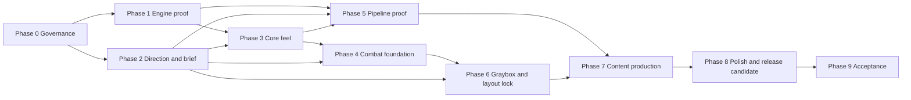

# Design

Status: the owner accepts it on the condition of D-27. Written in ASD-STE100 (D-17). The template is the design-doc-style skill (D-19).

- Supersedes: nothing. PR-1 is the first design doc of this repository.
- Sections 7 and 8 are the high-level roadmap (D-18). Focused roadmaps go in `docs/roadmaps/` (see `docs/roadmaps/readme.md`).
- External facts: the session checked each fact in `docs/research/technology-and-art-pipeline.md` on 2026-09-26. The link check ran on 2026-09-27.
- 2026-09-27 correction pass: the owner set D-12 to D-23. This doc moved to the template of the role models, and GitHub PR #1 closed (D-23).
- 2026-09-27 second pass: the owner answered the open questions (D-24 to D-38). The license is now MIT (D-24).
- 2026-09-27 third pass: Steam lists a game with the name Emberline. The project name is now Iron Absolution (D-39).
- 2026-09-27 fourth pass: the owner resolved the divergences of the PR-3 port (D-46 to D-53). D-53 corrects exit test 3 of PR-3. D-55 scopes G-12 to the game. D-92 later superseded D-55.
- 2026-09-27 fifth pass: the owner resolved the divergences of the PR-4 port (D-56 to D-59).
- 2026-09-27 sixth pass: PR-7 adds the focused roadmap of phase 1 (D-69 to D-75). The engine install now comes after PR-8, because section 8 put it before its runbook (F-19, D-69). The author session now adds the `review-override` label (D-76, F-20). D-95 later superseded D-75.
- 2026-09-27 seventh pass: PR-8 adds the engine toolchain (D-78 to D-82). The owner installs the engine during PR-8 (D-78). The project SSD is case-sensitive, so the engine gets a case-insensitive volume (F-21, D-81). D-97 later superseded D-81.
- 2026-09-28 eighth pass: the owner gave D-91 to D-100 in PR-10 and PR-12. The game ships on Windows alone (D-91), and the sessions run on the Windows PC (D-92). PR-12 to PR-14 move the project to Windows before PR-11 (D-93, D-94). M-9 goes out of scope (D-95). Each earlier Mac claim stays, with this dated correction.
- 2026-09-28 ninth pass: PR-14 moves the engine commands to `run.ps1` on the Windows PC and removes each Mac part (D-97). The owner gave D-104 to D-106. The C# commands are the one copy of each engine command (D-104).
- 2026-09-28 tenth pass: PR-11 records the gate of phase 1 and the first value of M-8. The owner gave D-108 to D-110.
- 2026-09-29 eleventh pass: PR-15 adds the focused roadmap of phase 2. The owner gave D-111 to D-114. Phase 2 starts after the gate of phase 1.
- 2026-09-29 twelfth pass: PR-16 adds `docs/game/` with the pillars and the combat proposals. The owner gave D-115 and D-116. The combat rules follow Doom (2016), so D-1, D-2, and G-1 change in part.
- 2026-09-29 thirteenth pass: PR-18 adds the provenance policy in `docs/game/provenance.md`, and checks the Meshy facts again (F-7). The owner gave D-118 to D-121. Meshy is for focal props on a paid plan (D-118).
- 2026-09-29 fourteenth pass: PR-19 adds the level brief in `docs/game/level-brief.md`. It records the gate of phase 2 and the value of M-8 at the end of phase 2. The owner gave D-122 to D-125. An original harvest tool replaces the chainsaw (D-125).
- 2026-09-29 fifteenth pass: PR-20 adds the focused roadmap of phase 3. The owner gave D-126 to D-132. Phase 5 now starts after the gate of phase 3, beside phase 4 (D-129).
- 2026-09-29 sixteenth pass: PR-21 adds the gym, the player character, and the movement metrics in `docs/game/movement-metrics.md`. The owner gave D-133 to D-136. A Python script in the editor makes the content (D-134).
- 2026-09-29 seventeenth pass: PR-22 adds the frame-time capture and the first value of M-3. The owner gave D-137 and D-138. `docs/research/frame-time-method.md` gives the facts of Epic and of the engine source.

## 1. Thesis

The product is one complete, polished level of a fast first-person shooter with limited resources (D-1). The player can play it again, but replay-value features are not a primary goal (D-37). Doom (2016) is a reference for combat intensity and pacing, and it gives the combat rules (D-115). The names, the art, the audio, and the layouts are original (D-2). The game uses Unreal Engine 5.8 (D-3, D-28) in a compact, hand-authored level (D-4) that takes 30 minutes or more (D-37). It ships on Windows alone (D-32, D-91).

Correction of 2026-09-28: the thesis named macOS and Windows until D-91. Correction of 2026-09-29: the thesis named Doom (2016) as a reference for intensity and pacing only until D-115.

The plan removes the costly unknowns first. The order is: engine proof on Windows (D-91), feel, combat loop, and art pipeline. The full level layout and the content production come after these gates, because they cost the most to change.

The owner decides the product. Approved facts cite a D-# id. Open choices cite an OQ-# id:

| Topic | State |
|---|---|
| Player verbs: move, jump, aim, shoot, change weapon, melee, mantle, interact, and use the harvest tool | Decided (D-116, D-125). `docs/game/pillars.md` gives the list. The proposal of PR-1 had perhaps a dash, and D-116 has none. Correction of 2026-09-29: the last verb was "use the chainsaw" until D-125. |
| The limited resources and the mechanic that gives them back | Health and ammo. A melee finish of a stunned enemy gives health, and a harvest tool with fuel gives ammo, as in Doom (2016) (D-115, D-125). Resolves OQ-10. Correction of 2026-09-29: an original harvest tool replaces the chainsaw, with the same rule (D-125). |
| Level length | 30 to 45 minutes for a first clear (D-37, D-122). `docs/game/level-brief.md` gives the targets. |
| Weapon roster, enemy roster, combat spaces, secrets | Three guns and the harvest tool, four enemy types with no boss, 10 combat spaces and 6 other spaces, 6 secrets, and 10 checkpoints (D-122 to D-124). `docs/game/level-brief.md` gives the targets and the content cost. |
| Replay value | Not a primary goal. The player can start the level again (D-37). |
| Setting, tone, and art direction | A monastery of cold iron on a sea cliff, a solemn tone, and a cold gothic look (D-117). `docs/game/art-proposals.md` gives the detail. Resolves OQ-9. |
| Sources of art and audio | Original work, CC0 1.0, CC BY 4.0, and AI generation with terms that give ownership (D-119, D-120). Meshy on a paid plan, for focal props alone (D-118). `docs/game/provenance.md` gives the policy. |
| Platforms and frame budget | Windows 120 fps at 1440p on the owner's PC (D-32). The macOS budget of 60 fps at 4K output went on 2026-09-28 (D-91). |
| Input devices | Keyboard and mouse (D-32). Gamepad is open (OQ-21). |
| Working title and project name | Iron Absolution, `IronAbsolution` in code (D-39) |

## 2. Lessons learned (carry into every PR)

- **L-1. One concern per PR.** Both role models keep each PR to one concern. A small PR gets a fast and exact review (D-5).
- **L-2. Fetch before you number a session.** Two providers of the-thing-below once wrote the same session number. Fetch the remote first, then read the highest number.
- **L-3. A finished check run is not a finished review.** On what-you-carry, the gitar check run finished 53 seconds before its review comment. Prove that the review is newer than the push.
- **L-4. Process work can crowd out game work.** In what-you-carry, 13 of the last 22 entries of phase 2 are review, gitar, night, or CI items. Add a gate only for a real failure.
- **L-5. An external review service can stop.** Both role models paused gitar when its quota ended. Keep one reversible switch for each external service.
- **L-6. A self-hosted runner on the owner's Mac cost too much.** What-you-carry retired it. Its night blocked PR checks for hours, and fork PRs ran code on that Mac.
- **L-7. Local work can bypass the review.** Session 1 found two local commits and untracked C++ that no review saw. The owner discarded them (D-25). Start each PR from `origin/main`, and report local work.

## 3. System map

| Component | Reads | Writes | Sensitivity |
|---|---|---|---|
| Registers: `docs/decisions.md`, `docs/questions.md` | owner answers | D-# rows, OQ-# entries | High. They are the source of truth. |
| This design doc and the focused roadmaps | registers, research | intent, phases, PR entries | High |
| Session handoff: `docs/session-handoff.md` | git state, PR state | one entry for each session | Medium |
| Skills: `.claude/skills/` | the task | the procedure of the session | Medium |
| Tools project (PR-2 onward) | documents, PR data | check results, review records | Medium |
| CI workflows (PR-2 onward) | the PR head | check runs | High. They gate the merge. |
| Codex review (PR-3) | the PR diff | `docs/reviews/pr-<n>.md` | High |
| Unreal project `IronAbsolution` (phase 1) | source, content, config | builds and packages for Windows (D-91). PR #14 removed the Mac targets (D-97). | High |
| Content script `Game/Scripts/build_content.py` (PR-21) | the C++ classes, the values of the script | the input, the player Blueprints, the tuning, and the gym, through LFS (D-134) | Medium. It is the source of each asset that it makes. |
| Frame-time capture `run.ps1 frame-capture` (PR-22) | the package, the views of the gym | a CSV file of the CSV profiler, the log, and the checks of D-137 | Medium. It gives each value of M-3. |
| Content pipeline (phase 5) | DCC exports, generated assets | Unreal assets through LFS | Medium. Each asset needs terms that allow redistribution (D-24). |

## 4. Cost model (what we pay, what we do not know)

What we pay:

- Model tokens for each PR. The-thing-below measured 68.4 million context tokens for its mean code PR.
- Owner time at each gate and for each question, and for each confirmation of a command that opens a game window (D-96). Correction of 2026-09-28: a session on the Windows PC runs the Windows builds and tests (D-33, D-92).
- GitHub LFS: the free quota is 10 GiB of storage and 10 GiB of bandwidth each month.
- Hosted CI minutes. Public repositories get hosted runners free.
- Meshy credits: none now. Each spend needs owner approval (D-8).

What we do not know, and the measurement that answers it:

- M-1: Peak memory of the Unreal Editor on the 16 GB Mac. Phase 1. First value on 2026-09-28 in PR-9: a peak memory footprint of 6.42 GB, with the empty test map open (`/usr/bin/time -l`). Correction of 2026-09-28: PR-14 records a first value on the Windows PC. The Mac value stays as history (D-98). First Windows value on 2026-09-28 in PR-14: a peak working set of 3.53 GB, and a peak of 4.18 GB of private bytes. The editor had the empty test map open for 30 seconds. The PC has 32 GB of memory, and the `Process` counters of .NET gave the values.
- M-2: Time of a clean build of the editor target and of a packaged build, on both platforms. Phase 1. First values of the editor target from a fresh clone, on 2026-09-28 in PR-9: 35.5 seconds on the Mac, and 45.3 seconds on Windows. First values of the packaged Development build on 2026-09-28 in PR-10: 136.5 seconds on the Mac, and 105.6 seconds on Windows. The Mac value comes from a fresh clone with a warm engine cache. The Windows value comes from the checkout of the owner, with a full cook. Each value is the `BuildCookRun time` of RunUAT. Correction of 2026-09-28: the Windows values count, and the Mac values stay as history (D-91). Values from a fresh clone on Windows through `run.ps1`, on 2026-09-28 in PR-14: 41.6 seconds for the editor target. The package took 101.25 seconds of `BuildCookRun time`.
- M-3: Frame time in the test gym on Windows, against the budget of D-32. Phase 3. Correction of 2026-09-28: the Mac goes (D-91). PR-22 gives the first value, and PR-27 gives the value at the gate (D-126). D-137 gives the method, and it resolves OQ-25. First value on 2026-09-29 in PR-22: a mean of 3.33 ms and a 99th percentile of 3.67 ms, over 6,004 frames in 20.0 seconds. Both values are inside the budget of 8.33 ms. The run used the Development package of commit `13bdbb1`, borderless fullscreen at 2560x1440, with VSync off and no frame-rate cap. The PC has an Intel Core i9-13900K, an NVIDIA GeForce RTX 4090 with the driver 616.92, and 32 GB of memory. The render thread sets the pace, and the mean time of the GPU is 1.96 ms. An earlier capture ran with another game open, and it gave a mean of 7.36 ms. That capture is void.
- M-4: Frame time in the combat sandbox at the maximum enemy count. Phase 4.
- M-5: Frame time and memory of the vertical-slice room. Phase 5.
- M-6: Time to change one kit piece and see the change in each space. Phase 5.
- M-7: First-clear time of the full level in graybox. Phase 6.
- M-8: LFS storage in use, at the end of each phase. Each phase. D-108 gives the method. The value at the end of phase 1, on 2026-09-28 in PR-11: 8,404 bytes in one LFS object, the test map. The session read a fresh clone of `main` at `95546e3`. The value uses less than 0.0001% of the free quota of 10 GiB. The value at the end of phase 2, on 2026-09-29 in PR-19: 8,404 bytes in one LFS object, the test map. The session read a fresh clone of `main` at `4c1dce4`. Phase 2 added no LFS object.
- M-9: Internal resolution of TSR that holds 60 fps at 4K output on the Mac (D-32). ⏸ Out of scope since 2026-09-28 (D-95). The first frame time comes from M-3.

## 5. Defect and finding register

Status legend:

- ✅ done (code merged, or "doc" for a document-only correction)
- 🔧 planned (item listed)
- ⚠ constraint (binds a pull request)
- ❓ needs owner input
- ⏸ out of scope (a decision parked it)
- 🅿 parked

| Id | Date | Finding | Evidence | Status |
|---|---|---|---|---|
| F-1 | 2026-09-26 | The repository is GPL-3.0. The Unreal Engine EULA prohibits a combination with GPL code. | EULA for Creators, "Non-Compatible Licenses" | ✅ doc. The license is MIT (D-24). |
| F-2 | 2026-09-26 | The owner's local `main` holds two commits and untracked C++ that no review saw. | `git status` on the owner's checkout | ✅ doc. Discarded on 2026-09-27 (D-25). |
| F-3 | 2026-09-26 | Xcode 16.2 is on the Mac. Unreal Engine 5.8 needs Xcode 26.0 or later. Xcode 26.4 does not work with it. | Epic macOS requirements, Apple Xcode table | ⏸ out of scope (D-91). PR #14 removed the Xcode pin (D-97). |
| F-4 | 2026-09-26 | The internal disk has 45 GB free. The project SSD has 923 GB free. | `df -h` | ⏸ out of scope (D-91). The Windows PC keeps the default cache place (D-100). |
| F-5 | 2026-09-26 | The Mac has 16 GB of memory. Epic gives 16 GB as the minimum and 32 GB as the recommendation. | Epic macOS requirements | ⏸ out of scope (D-91). PR-14 measures M-1 on the Windows PC (D-98). |
| F-6 | 2026-09-26 | The Epic input overview page calls Enhanced Input experimental. The Enhanced Input page says it is on by default. | Two Epic pages for 5.8 | ✅ PR #10: on 2026-09-28 the Plugins window of the editor showed Enhanced Input 1.0 on, with no Beta or Experimental label. The automation test reads the Enhanced Input classes |
| F-7 | 2026-09-26 | The Meshy plugin has Windows builds for Unreal Engine 5.4 to 5.7 only. Its bridge needs Meshy Pro. Correction of 2026-09-29: PR-18 checked the facts again, and they stand. | Meshy integration page, `docs/game/provenance.md` section 6 | ✅ doc: the path of D-118 uses no plugin (PR-18) |
| F-8 | 2026-09-26 | Hosted runners have no Unreal Engine. | Role-model CI, GitHub runners | ✅ doc. Engine PRs attach local logs (D-31). |
| F-9 | 2026-09-26 | Both providers push as one GitHub account. No machine check can prove which provider wrote a review. | The-thing-below merge runbook | ⚠ accepted risk. Binds PR-3 and PR-6. |
| F-10 | 2026-09-27 | The commits of GitHub PR #1 carried AI co-author lines. Tenet T-6 forbids them. | GitHub PR #1 | ✅ doc. PR-1 moved to new commits (D-23). |
| F-11 | 2026-09-27 | Tenet T-2 kept assertions on in shipped builds. Unreal removes `check` from the Shipping configuration by default. | Epic asserts page | ✅ doc. Asserts follow the Unreal rules (D-34). |
| F-12 | 2026-09-27 | D-6 asks for a review of each PR. Both role models let the owner skip the review of a PR with no code through a label. | Tenet T-4 of the role models | ✅ doc. The owner label comes after PR-6 (D-35). |
| F-13 | 2026-09-27 | The ste-writing skill of the-thing-below starts with a stray table row before its front matter. | Line 1 of that skill | ✅ doc. The port in PR-1 leaves the row out. |
| F-14 | 2026-09-27 | 60 fps at 4K output on the base M4 with 16 GB is a hard target. Epic recommends an M3 or later with 32 GB for development. | Epic macOS requirements, TSR page | ⏸ out of scope (D-91, D-95). |
| F-15 | 2026-09-27 | A level of 30 minutes or more multiplies the content cost of phases 6 and 7. Correction of 2026-09-29: the level brief gives the cost of 16 spaces, 40 to 60 kit pieces, and 39 to 53 props (PR-19, D-122). | D-37, D-122 | ⚠ binds phases 6 and 7: the cost of the brief |
| F-16 | 2026-09-27 | MIT covers the whole repository. An asset with terms that forbid redistribution, or free Meshy output under CC BY, cannot enter it as MIT content. Correction of 2026-09-29: section 4 of `docs/game/provenance.md` gives the rule (PR-18). A file under a license that forbids redistribution stays out of the repository and the package. A CC BY 4.0 file keeps its terms, with an attribution in its record and in the credits file (D-119). | D-24, D-119, Meshy terms | ⚠ binds phase 5: the manifest, the credits file, and the check (D-121) |
| F-17 | 2026-09-27 | Unreal cannot build Windows packages on the Mac. Windows builds need the Windows PC of the owner. | D-33 | ⏸ out of scope (D-91). The engine work runs on the Windows PC (D-92). |
| F-18 | 2026-09-27 | The time rule of the `review-override` label reads the committer time of the work head. The commit author sets that time, so a backdated commit after the label passes. | Review P2-1 of PR #7, reproduced with a backdated commit | ⚠ accepted risk (D-68). The rule stops an accident, not an attack (F-9). |
| F-19 | 2026-09-27 | Section 8 put the engine install (step 9) before the setup runbook of phase 1, which guides that install. On that date the Mac had no engine, no Xcode app, and no Git LFS. | Section 8, the work of phase 1, `xcode-select -p` and `git lfs version` on the Mac | ✅ doc. The install comes after PR-8 (D-69). |
| F-20 | 2026-09-27 | D-76 lets the author session add the `review-override` label. The messages of `review-gate` and `run.ps1 codex-review`, their test, and the description of the live label still say that the owner adds it. | `ReviewGateRules.cs`, `StartChecks.cs`, `ReviewGateCommandTests.cs`, and the label on GitHub | ✅ done in PR-8 (D-77, D-82) |
| F-21 | 2026-09-27 | The project SSD is case-sensitive APFS. Unreal Engine does not start from a case-sensitive file system on macOS. | `diskutil info /Volumes/SSD-1TB`, [Epic forum](https://forums.unrealengine.com/t/help-epic-games-launcher-unreal-engine-does-not-support-running-from-case-sensitive-file-systems/2021754) | ✅ doc. A case-insensitive volume on the SSD holds the engine (D-81).. D-81 is superseded by D-97, and PR #14 removed the Mac part. |
| F-22 | 2026-09-27 | The first Windows check read the name of each MSVC toolset folder. UnrealBuildTool reads the product version of `cl.exe`, and a servicing update keeps the folder name. The check failed a good toolset: the folder 14.50.35717 held `cl.exe` 14.50.35739. | The run of the owner in PR-8, `MicrosoftPlatformSDK.cs` of 5.8.3 | ✅ done in PR-8. The check reads `cl.exe` (D-74). |
| F-23 | 2026-09-27 | The editor starts its Zen cache server during its own startup, before Editor Preferences can open. The default data folder of Zen is on the internal disk. So a cache path that the owner sets at the first start comes too late for the shaders of that start. The UI name of the setting in 5.8.3 is "Local DDC Path". The editor stores it in the key-value file of the user, and Zen reads it from there. | `ZenServerInterface.cpp` and `EditorSettings.cpp` of 5.8.3, and the section `[Zen.AutoLaunch]` of `BaseEngine.ini` | ✅ PR #10: the owner writes the setting before the first start (D-85). The log of the editor shows the path on the volume. D-85 is superseded by D-97, and PR #14 removed the Mac part. |
| F-24 | 2026-09-28 | `make toolchain-check` passed on the Mac, and the first start of the editor then stopped with "cannot execute tool 'metal' due to missing Metal Toolchain". Xcode 26 downloads the Metal Toolchain apart from the app, and the check did not read it. `xcodebuild -showComponent MetalToolchain` gave `Status: uninstalled`. | The dialog of the editor, and the output of `xcodebuild` | ✅ PR #10: the check has a Metal Toolchain pin (D-87). D-87 is superseded by D-97, and PR #14 removed the Mac part. |
| F-25 | 2026-09-28 | The first packaged build on the Mac failed in the game target: "no member named 'EditorStartupMap' in 'UGameMapsSettings'". The automation test of PR-9 reads a field that exists only under `WITH_EDITORONLY_DATA`. The editor target of PR-9 compiled it, and no build of PR-9 compiled the game target. | The output of RunUAT, and `GameMapsSettings.h` of 5.8.3 | ✅ PR #11: the check of the editor map has its own guard, and `make package-build` compiles the game target |
| F-26 | 2026-09-28 | A Mac package with no `-package` step stopped at its start with "Library not loaded: @rpath/libtbb.12.dylib". The archive step took the app of `Game/Binaries`, and that app holds no libraries and no content. | The output of dyld, and the archive lines of RunUAT | ✅ PR #11: the Mac build had the `-package` step. PR #14 removed the Mac build (D-97). |
| F-27 | 2026-09-28 | The Mac package runs in the App Sandbox, with the default bundle id `com.YourCompany.IronAbsolution`. It writes its log in its container, and `-abslog` to a path outside the container writes no file and gives no error. | `codesign -d --entitlements`, and a run with `-abslog` | ✅ PR #11: the Mac start command read the log from stdout, and the app had the bundle id of D-90. D-90 is superseded by D-97, and PR #14 removed the Mac part. The Windows package writes its log through `-abslog`. |
| F-28 | 2026-09-28 | The hosted test `PackageRunCommandTests.AStubRunThatWritesTheSuccessLinePasses` failed one time after 6 ms with the exit code 1, and its rerun passed. So the stub of D-103 probably did not start. An assumption, not proved: Linux refused to start the new copy of the stub ("Text file busy") while a parallel test started a process. Correction of 2026-09-29: the `coverage report` job of PR #20 failed two times in the same way. A test of `ToolchainCheckCommandTests` and a test of `EditorTestCommandTests` each failed after 6 or 7 ms, and each rerun passed. Correction of 2026-09-29: the `coverage report` job of PR #22 failed one time in the same way. The test `TheGatherReadsEachToolsetFolderOfTheInstallThatVswhereGives` failed after 10 ms, and the rerun passed. Correction of 2026-09-30: PR #23 failed three times in the same way. A test of `EditorTestCommandTests` failed two times in the `coverage report` job, after 9 ms and after 6 ms. A test of `FrameCaptureCommandTests` failed one time in the `build, test, and format` job, after 9 ms. Each rerun passed. The error of the second test starts with the path of the stub, so the stub did not start. | The first attempt of CI run 36493078596 on PR #14, and the first rerun or failure in 40 runs of `ci`. CI runs 36566642502 and 36567047831 on PR #20. CI run 36616780058 on PR #22. CI runs 36658981182, 36659819188, and 36660862369 on PR #23 | 🔧 planned. The owner chose to record it in PR-14. A later PR proves the cause and fixes the start of the stub. |
| F-30 | 2026-09-29 | D-116 puts the verb "change weapon" in phase 3. The work of phase 3 in section 7 gave it one weapon, so the verb had no second weapon. | D-116, and the work of phase 3 in section 7 | ✅ doc: one weapon rule with two data assets (D-128, PR-20) |
| F-29 | 2026-09-28 | After the removal of PR-14, `.editorconfig` held a section for the Makefile, and the comment of `IronAbsolution.Tests/PowerShellScript.cs` named the scripts folder. PR-14 removed the Makefile and the scripts folder. Neither leftover is a Mac part of exit test 6 of PR-14. | A search of the tracked files for line 11 of the gate of phase 1 | ✅ PR #15: the section and the comment go. `EditorConfigTests` refuses a section for a file that git does not track (D-110). |

## 6. Guardrails (the safety contract for every PR)

### 6.1 Tenets

The tenets are the constitution. When a tenet conflicts with speed or convenience, the tenet wins. When two tenets conflict, the earlier one in this order wins: T-5, T-2, T-3, T-4, T-1. T-6 is absolute. The tenets come from the role models (D-12).

- **T-1. Readable, simple, not wasteful.** Explicit over implicit. A fresh model must understand a function from the function and its helper signatures. Helpers go one level deep. Two concrete cases come before any abstraction. No clever one-liners. Tune only on measurement.
- **T-2. Zero silent failures.** No swallowed error. An absent value is an error, never a zero. Every error carries its context. Asserts follow the Unreal rules (D-34).
- **T-3. Tests cover everything.** No merge without tests. A bug fix ships with a regression test that fails on the old code.
- **T-4. Cross-provider review before merge.** The provider that wrote the code does not review it (D-6). The review record in `docs/reviews/` records the findings. After PR-6, the owner can skip the review of a PR with no code through the `review-override` label (D-35).
- **T-5. Document everything.** Continuity is the first duty. Each session adds its entry at the top of `docs/session-handoff.md`. The other documents change when intent, a decision, or a plan changes.
- **T-6. No attribution.** No code, commit, PR description, or GitHub comment names an agent, harness, or model as the source of work (D-16). Two places are exempt: the author field in `docs/session-handoff.md`, and the files in `docs/reviews/`.

### 6.2 Guardrails

- **G-1.** All content is original. Reference games inform feel and pacing, never assets, names, mechanics, or layouts (D-2). Correction of 2026-09-29: the combat rules follow the mechanics of Doom (2016) (D-115). The names, the art, the audio, the layouts, and the look and sound of each cue stay original.
- **G-2.** The level stays compact and hand-authored. Large-world streaming needs a measurement first (D-4).
- **G-3.** No Meshy spend without owner approval. No generated mesh enters the game without a cleanup pass (D-8).
- **G-4.** The scope is one level until the owner accepts it. A new level or system goes to `docs/questions.md` (D-1).
- **G-5.** Feel comes before content. The gates of phases 3 and 4 come before phases 6 and 7 (D-27).
- **G-6.** No commit holds credentials, account data, generated caches, or machine-specific paths (D-9).
- **G-7.** One concern per PR (D-5).
- **G-8.** Each check that does not exist yet has a line that names the PR that creates it.
- **G-9.** No agent edits `LICENSE` without an instruction of the owner (D-10, D-24).
- **G-10.** Infrastructure follows the role models. When the two differ, ask the owner (D-12, D-13).
- **G-11.** Unreal best practices govern the engine work, the game code, and the content (D-34).
- **G-12.** Each change keeps the game working on Windows and inside its budget (D-32, D-91). The development tools and the sessions run on the Windows PC (D-92). Correction of 2026-09-28: this guardrail named macOS and the Mac tools until D-91 and D-92 superseded D-55.

## 7. Roadmap

The phases go from an empty repository to the accepted first level. Each phase has an objective, its dependencies, its work, and a gate. Phase 0 lists its PR entries here, because its PRs are small. Each later phase gets a focused roadmap after the owner accepts this roadmap (D-11). The labels are: evidence (with a link), recommendation, assumption, and unknown.

Dependencies:

The critical path is phases 0, 1, 3, 4, 6, 7, 8, and 9. Phase 2 runs beside phase 1. Phase 5 runs beside phases 3 and 4, and its gate comes before phase 7. Correction of 2026-09-29: phase 5 starts after the gate of phase 3 and runs beside phase 4 (D-129).

### Phase 0: Governance and the repository foundation (gate: PR-1 to PR-6 merged, each check required and green, one real `run.ps1 codex-review` record)

Phase 0 ports the infrastructure of the role models (D-12). It needs no engine. Each entry follows the implementation that D-14 to D-23 name. When a later entry meets a new difference between the two role models, the session asks the owner (D-13).

#### PR-1: Documents and the roadmap

PR-1 adds the registers, this design doc, the research, the agent files, the handoff, the PR template, the ste-writing and design-doc-style skills, and `.claude/settings.json`. It replaces `LICENSE` with the MIT License (D-24).

- Exit tests: 1. The ste-check rules of the-thing-below give no finding that applies to this repository. 2. Each link and each cited id resolves. 3. The diff holds only the files of this entry.
- Review focus: the roadmap order, the open questions, and the claims of the research.
- Check clause: the ste-check job comes in PR-2.
- Gate: exit tests 1 to 3 pass, a Codex review record says `Ready for owner merge`, and the owner merges.

> *In plain English:* The repository gets its rules, its plan, and its open questions for the owner. There is no game code yet.

#### PR-2: Tools project and ste-check

PR-2 creates one C# .NET tools project, `IronAbsolution.Tools` (D-15, D-39). It ports the ste-check command of the-thing-below and its tests (D-17). It adds a Makefile and a hosted Linux workflow that runs the check and the tests on each PR. Newer pushes cancel older runs. Correction of 2026-09-28: PR-13 makes `run.ps1` the entry of each development target, and the Makefile keeps the Mac engine targets until PR-14 (D-99).

D-40 to D-45 set the stack, the Makefile, the CI layout, the pre-commit hook, the C# skill, and the coverage report. The port drops two rules of the-thing-below. AGENTS 2 reads a test filter that this repository does not have. DOCS 1 reads a review gate that PR-6 adds.

- Exit tests: 1. The tests pass on the hosted runner. 2. A PR with a broken rule gets a red check. 3. The docs of PR-1 pass.
- Gate: exit tests 1 to 3 pass.

> *In plain English:* A machine now checks the writing rules and the links of every document on each PR.

#### PR-3: Automatic Codex review

PR-3 ports `run.ps1 codex-review -PR <n>` from what-you-carry (D-14). It ports the pr-review, review-response, and one-pr-one-session skills and the review record format (D-46). The gitar start check stays out until OQ-16 (D-7). D-47 to D-53 resolve the divergences of the port. They set the install of the CLI, the worktree branch, the effective head, and the time limit. They also set the transcripts, the thread check, and the API key.

- Exit tests: 1. The command tests pass. 2. A real run on a PR pushes a review record and a handoff entry as one commit. 3. A run with an API-key login alone refuses to start with the exit code 3, and a key in the environment never reaches Codex (D-53).
- Correction of 2026-09-27: exit test 3 said "A run with an API key in the environment refuses to start." The owner chose the behavior of what-you-carry instead (D-53).
- Review focus: the provider gate, the exit codes, and the three-strike stop.
- Gate: exit tests 1 to 3 pass.
- Status: ✅ done in PR #4.

> *In plain English:* After each push, the author runs one command. Codex then reviews the PR and writes its verdict into the repository.

#### PR-4: Documents gate and handoff rotation

PR-4 ports the doc-gate and handoff-rotate commands of what-you-carry. The doc-gate job reads the Documents section of the PR and checks that the newest handoff entry names the branch. D-56 to D-59 resolve the divergences of the port. They set the workflow file of the gate, its rule set, the sort of an entry out of place, and the Makefile target.

- Exit tests: 1. A PR with an empty Documents line gets a red check. 2. Rotation moves the eleventh entry to the archive.
- Review focus: the rules against the diff, the parse of a handoff with no title, and the inputs of the workflow.
- Gate: exit tests 1 and 2 pass.
- Status: ✅ done in PR #5.

> *In plain English:* A machine checks that each PR says what it did to each document, and it keeps the handoff short.

#### PR-5: Ruleset of main as code

PR-5 ports `.github/rulesets/main.json` and `docs/runbooks/main-ruleset.md` from what-you-carry, with a test that binds the check names to the jobs. D-60 to D-63 resolve the divergences of the port. They set the bypass, the required checks, the scope of the file, and the application of the live ruleset. The author session applies the live ruleset before the merge (D-63).

- Exit tests: 1. The ruleset test passes. 2. A `gh api` read of the live ruleset matches the file.
- Correction of 2026-09-27: the entry said "The owner applies the live ruleset." The owner told the author session to apply it before the merge (D-63).
- Review focus: the bindings of the check names to the jobs, the bypass, and the steps of the runbook.
- Check clause: the `review-gate` check comes in PR-6, and PR-6 adds it to the ruleset.
- Gate: exit tests 1 and 2 pass, and the live ruleset matches the file before the merge.
- Status: ✅ done in PR #6.

> *In plain English:* GitHub now refuses a merge to main without a PR and green checks.

#### PR-6: Review gate and auto-merge

PR-6 ports the review-gate workflow and the `review-gate` command. The workflow runs the tool of the base branch, and the tool reads the review record of the PR head as data. The job is the required check, and no mode file exists (D-64). The command honors the `review-override` label that only the owner adds to a PR with no code (D-35, D-65, D-68). A PR of documents alone merges through that label alone (D-66). PR-6 adds `review-gate` to the required checks in the file of the ruleset of `main` (D-61, D-64).

GitHub runs the workflow only from the default branch, so PR-6 gets no `review-gate` check. PR-6 merges under the four checks of D-61. The live ruleset takes `review-gate` after the merge, and the owner turns on auto-merge (D-67). The auto-merge procedure of the role models then applies (D-12).

- Exit tests: 1. A PR with no approving record for its head gets a red review-gate check. 2. A PR with an approving record gets a green check. 3. After the merge, the comparison of the live ruleset with the file on `main` gives an empty diff.
- Correction of 2026-09-27, PR-7: the author session adds the label, on the standing instruction of the owner (D-76). PR-8 corrects the text of the command (D-77).
- Correction of 2026-09-27: the exit tests 1 and 2 need the workflow on `main`. The command tests prove both on real commits in PR-6. The first PR after PR-6 proves both on GitHub (D-67).
- Review focus: the trust boundary of the workflow, the label rules against D-65, and the order of D-67.
- Gate: exit tests 1 to 3 pass.
- Status: ✅ done in PR #7.

> *In plain English:* GitHub merges a PR by itself only after the checks, the Codex review, and the owner's confirmation.

#### Gitar pass (no PR id until OQ-16)

When the owner confirms that gitar works here, one PR ports the gitar-wait script and the gitar-review skill of the role models. Before that PR, the session asks which role model to follow on the required check (OQ-16).

> *In plain English:* An extra automated reviewer joins later, but only after the owner says that it works.

### Phase 1: Engine and toolchain proof (gate: a clean clone builds, packages, and runs one headless test on Windows, M-1 and M-2 recorded)

- Objective: prove the engine, the toolchain, the source control, and the tests on the Windows PC before any game code. Correction of 2026-09-28: the objective named the Mac too until D-91. The gate named a first M-9 until D-95.
- Dependencies: phase 0. The owner answered each engine question: D-24, D-28 to D-34, and D-39. The owner installs Unreal Engine 5.8 and Xcode 26.1.1 on the SSD, and Unreal Engine 5.8 on the Windows PC. Correction of 2026-09-27: the install comes after PR-8, from its runbook (D-69). Second correction of 2026-09-27: the install comes during PR-8, on a case-insensitive volume of the SSD (D-78, D-81, F-21). Third correction of 2026-09-28: PR-14 removes the Mac install (D-97).
- Work: a setup runbook for both machines, with the owner actions marked. The minimal C++ project `IronAbsolution`, with one module and Enhanced Input. An empty test map. LFS attributes. Scripts for the headless automation test and the package on both platforms. The Windows commands that the owner runs (D-33). An evidence template for engine PRs (D-31). Unreal best practices apply (D-34). Correction of 2026-09-28: PR-13 moves each development command to `run.ps1` on the Windows PC, and the whole test suite runs there (D-99, D-101 to D-103).
- Focused roadmap: `docs/roadmaps/phase-1-engine-proof.md` holds PR-8 to PR-14 and the gate (D-71, D-94). PR-7 adds it. Status: ✅ done in PR #8. PR-12 adds PR-12 to PR-14. The gate of phase 1 passes: ✅ PR #15 records the evidence of each line in section 7.9 of the phase file.
- Exit evidence: a clean clone builds the editor target and a packaged Development build on each platform. The owner posts the Windows logs. Each package starts and stops from the command line. One automation test passes headless, with its log. A fresh clone restores LFS content. M-1 and M-2 have values. A first TSR test at 4K output on the Mac gives a first value of M-9. The project records its World Partition choice with a reason (D-4). Correction of 2026-09-28: the evidence is for the Windows PC alone, and a session posts the logs (D-91, D-92). M-9 is out of scope (D-95). PR-14 gives M-1 on Windows (D-98).

> *In plain English:* Before we build the game, we prove that the engine builds, tests, and packages on Windows. The Mac was a second platform until 2026-09-28.

### Phase 2: Game direction and the level brief (gate: the owner picks for OQ-9 and OQ-10, and a brief with numeric targets)

- Objective: turn the intent of the owner into a short brief that a test can check.
- Dependencies: PR-1. It runs beside phase 1. Correction of 2026-09-29: no PR of phase 2 started before the gate of phase 1. PR-15 starts phase 2 after that gate.
- Work: pillars and the core loop. Two or three original proposals for the recovery mechanic (OQ-10) and for setting, tone, and art (OQ-9), as D-36 sets. The level brief for 30 minutes or more (D-37). The provenance policy for art and audio (D-24, D-38). The Meshy choice after the art direction (OQ-12).
- Focused roadmap: `docs/roadmaps/phase-2-direction-brief.md` holds PR-16 to PR-19 and the gate (D-111, D-112). PR-15 adds it. Status: ✅ done in PR #16. The game documents go in `docs/game/`, and PR-16 creates the folder (D-114). PR-16 status: ✅ done in PR #17. The owner picked the combat rules of Doom (2016) (D-115) and the player verbs (D-116). PR-17 status: ✅ done in PR #18 (D-117). PR-18 status: ✅ done in PR #19. The owner gave the Meshy choice and the rules of the provenance policy (D-118 to D-121). PR-19 status: ✅ done in PR #20. The owner gave the targets of the brief (D-122 to D-125). The gate of phase 2 passes in PR #20 (PR-19).
- Exit evidence: decision rows for the picks of OQ-9 and OQ-10. The brief gives numbers: clear time, combat spaces, and roster sizes. F-15 applies: the brief states the content cost of the length.

> *In plain English:* The owner decides what the game feels like, looks like, and how long the level is.

### Phase 3: Core-feel prototype (gate: owner feel sign-off, M-3 within the budget of D-32 on Windows)

- Objective: make movement, aim, and fire feel fast and exact in a graybox gym before other systems.
- Dependencies: phase 1, the verbs of phase 2, and the budgets and input of D-32.
- Work: player movement and camera, with metric markers. Keyboard and mouse input through Enhanced Input, ready for a later gamepad (OQ-21). Sensitivity, invert, and field of view. One weapon from fire to hit feedback and ammo. Automated tests of movement and the weapon, and a frame-time capture. Correction of 2026-09-29: the one weapon is one hitscan rule with two data assets, so the verb "change weapon" has a test (D-128, D-130, F-30).
- Focused roadmap: `docs/roadmaps/phase-3-core-feel.md` holds PR-21 to PR-27 and the gate (D-126, D-127). PR-20 adds it. Status: ✅ done in PR #21. PR-21 status: ✅ done in PR #22. The owner gave the gym map, the content script, the first pace, and the keys (D-133 to D-136). PR-22 status: ✅ done in PR #23. The owner gave the method of M-3 (D-137) and the window mode (D-138).
- Exit evidence: the owner plays the packaged gym and records a sign-off or a list of changes as a D-# row. M-3 has a profile on Windows. Correction of 2026-09-28: M-9 is out of scope (D-95). The movement metrics have values, because the layout rules of phase 6 use them. The tests pass headless.

> *In plain English:* We make moving and shooting feel right in the gym, an empty room of test blocks, before we build anything on top.

### Phase 4: Combat foundation (gate: owner combat sign-off, M-4 within budget, a new arena needs no new rule code)

- Objective: prove the full combat loop with limited resources in an arena sandbox, as rules that the level can use again.
- Dependencies: the gate of phase 3, and the loop and roster of phase 2.
- Work: damage, health, and resource rules with the recovery mechanic. The weapon framework and roster. Enemy archetypes (the focused roadmap picks the AI framework). The encounter framework. Hit feedback and the HUD. Death, checkpoint, and restart.
- Exit evidence: the sandbox builds a new encounter by placement and data only. The owner records the combat sign-off. M-4 has a profile. The rule tests pass, and a restart after death has a measured time.

> *In plain English:* We prove that the fights are intense and that scarce resources create tension, in a test arena.

### Phase 5: Art and audio pipeline proof (gate: a vertical-slice room at target quality, M-5 and M-6 recorded, owner approval of the look)

- Objective: prove a repeatable content pipeline on one small room before we pay for a whole level.
- Dependencies: phase 1 and the art direction of phase 2. It runs beside phases 3 and 4. The kit grid waits for the movement metrics of phase 3. Correction of 2026-09-29: phase 5 starts after the gate of phase 3, and its phase file is a separate PR. It runs beside phase 4 (D-129).
- Work: standards for scale, grid, pivots, names, collision, UVs, texel density, LODs, and folders. A DCC round trip, for example Blender to FBX to Unreal. A kit and trim-sheet prototype. A measured choice of the light method. The audio pipeline (D-38). A Meshy trial of one to three props, on the terms of D-118 and with owner approval of the spend (D-8). The provenance manifest, the credits file, and the import checks (D-119, D-121). A plan for the animation sources, which is still unknown.
- Exit evidence: the room meets M-5 on Windows (D-91). M-6 has a value. Each asset in the room has a provenance record. The import checks pass. The owner approves the look as a D-# row.

> *In plain English:* We finish one small room to full quality first, to prove that our art method works and runs fast.

### Phase 6: Level graybox and the layout lock (gate: the full level plays from start to end, M-7 in the brief range, owner layout lock)

- Objective: build and tune the whole level in graybox until flow, pacing, and difficulty work.
- Dependencies: the gate of phase 4, the brief of phase 2, and the metrics of phase 3. The grid of phase 5 if ready.
- Work: a beat chart and a flow diagram. A graybox of each space, one PR for each space. Encounter placement and tuning. A playtest protocol and log. A map collaboration method if two people need one map.
- Exit evidence: recorded plays meet the clear-time range of the brief. No blocker remains in progression, navigation, or collision. The owner records the layout lock. After the lock, a layout change needs an owner decision, because it breaks art.

> *In plain English:* We build the whole level in plain blocks and tune it until it plays well. Then we freeze the layout.

### Phase 7: Level content production (gate: no placeholder left or each one waived, the budget met in each space)

- Objective: apply the proven pipeline to the locked layout.
- Dependencies: the gates of phases 5 and 6.
- Work: one PR group for each space: kit and architecture, props and dressing, light, audio, effects, and performance passes.
- Exit evidence: the placeholder list is empty, or the owner waived each item. Each space meets the budget in its worst view, with a profile. The provenance manifest is complete. The asset checks pass.

> *In plain English:* We give every space its final art, light, and sound, and we keep it fast.

### Phase 8: Integration, polish, and the release candidate (gate: a packaged Windows candidate from a clean clone, no known crash or blocker, the budgets met)

- Objective: turn a complete level into a complete product that the player can start again (D-37).
- Dependencies: phase 7. The menu and settings work can start after phase 4.
- Work: menu, level, results, and restart flow. Settings, remapping, and basic accessibility. The gamepad choice (OQ-21). Tuning from playtests. Bug triage and the release bar. The package, the signature, and the distribution form for Windows (D-91).
- Exit evidence: recorded commands package the Windows candidate from a clean clone. No known crash, blocker, or progression bug remains. The player can start the level again from the menu. The budgets of D-32 hold across the level.

> *In plain English:* We add menus, settings, and polish, and we fix bugs until the Windows build is ready to ship.

### Phase 9: First-level acceptance (gate: the owner's acceptance as a D-# row, and a release tag on the accepted commit)

- Objective: the formal acceptance of the first level by the owner.
- Dependencies: phase 8.
- Work: an acceptance checklist from D-1 and the brief. Owner plays of a clean packaged build. A release tag and a retrospective.
- Exit evidence: the owner completes the level more than one time, on Windows (D-91). The checklist items pass or have a waiver. A D-# row records the acceptance.

> *In plain English:* The owner plays the finished level and accepts it. That ends the first goal.

### When this roadmap is complete

This high-level roadmap is complete when three conditions hold:

- A Codex review record approves PR-1, and the owner merges it (D-6, D-5).
- The owner accepts the roadmap or its revisions as a D-# row. D-27 records a conditional acceptance.
- Each phase names its objective, dependencies, work, exit evidence, and questions.

After that, each phase gets a focused roadmap just before it starts. `docs/roadmaps/readme.md` gives the rule. A change to a phase, its order, or its gate cites a D-# row.

## 8. Sequence (strict order, single owner)

1. PR-1: documents and the roadmap. Owner: the author session. The owner merges after the Codex review.
2. The owner answered OQ-1 to OQ-8, OQ-11, OQ-13, and OQ-18 to OQ-20 on 2026-09-27 (D-24 to D-38).
3. PR-2: tools project and ste-check.
4. PR-3: automatic Codex review.
5. PR-4: documents gate and handoff rotation.
6. PR-5: ruleset of main as code. The author session applies the live ruleset before the merge (D-63).
7. PR-6: review gate and auto-merge. After the merge, `review-gate` joins the live ruleset, and the owner turns on auto-merge (D-67).
8. Gate of phase 0.
9. PR-7: the focused roadmap of phase 1. Its PR ids continue after PR-6.
10. PR-8: the engine toolchain. Then the owner installs the engine and Xcode on the Mac, and the engine on the Windows PC (D-28, D-33). Correction of 2026-09-27: the install was step 9, before its runbook (F-19, D-69). Second correction of 2026-09-27: the owner installs during PR-8, before its merge (D-78).
11. PR-9 to PR-14 in the order of section 8 of the phase file. Correction of 2026-09-28: PR-12 to PR-14 come before PR-11, and they move the project to Windows alone (D-93, D-94). Phase 2 starts beside phase 1. The owner picks for OQ-9 and OQ-10, then answers OQ-12. Correction of 2026-09-29: no PR of phase 2 started beside phase 1.
12. Gate of phase 1, then gate of phase 2. The gate of phase 1 passes in PR #15 (PR-11). Phase 2 holds PR-15 to PR-19, in the order of section 8 of its phase file (D-111, D-112). The gate of phase 2 passes in PR #20 (PR-19).
13. Phase 3, then its gate. Phase 5 starts beside it. Correction of 2026-09-29: phase 3 holds PR-20 to PR-27, in the order of section 8 of its phase file (D-126, D-127). Phase 5 waits for the gate of phase 3 (D-129).
14. Phase 4, then its gate. Correction of 2026-09-29: phase 5 runs beside phase 4. Its phase file comes after the gate of phase 3 (D-129).
15. Gate of phase 5.
16. Phase 6, then the layout lock.
17. Phase 7, then its gate.
18. Phase 8, then its gate.
19. Phase 9: acceptance by the owner.

## 9. Open questions

The open questions are in `docs/questions.md`. Each question has an OQ-# id. Record the date and the answer there when one arrives.
