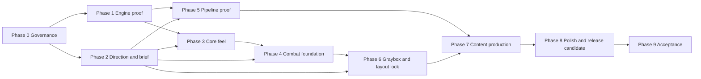

# Design

Status: the owner accepts it on the condition of D-27. Written in ASD-STE100 (D-17). The template is the design-doc-style skill (D-19).

- Supersedes: nothing. PR-1 is the first design doc of this repository.
- Sections 7 and 8 are the high-level roadmap (D-18). Focused roadmaps go in `docs/roadmaps/` (see `docs/roadmaps/readme.md`).
- External facts: the session checked each fact in `docs/research/technology-and-art-pipeline.md` on 2026-09-26. The link check ran on 2026-09-27.
- 2026-09-27 correction pass: the owner set D-12 to D-23. This doc moved to the template of the role models, and GitHub PR #1 closed (D-23).
- 2026-09-27 second pass: the owner answered the open questions (D-24 to D-38). The license is now MIT (D-24).
- 2026-09-27 third pass: Steam lists a game with the name Emberline. The project name is now Iron Absolution (D-39).

## 1. Thesis

The product is one complete, polished level of a fast first-person shooter with limited resources (D-1). The player can play it again, but replay-value features are not a primary goal (D-37). Doom (2016) is a reference for combat intensity and pacing only. All content is original (D-2). The game uses Unreal Engine 5.8 (D-3, D-28) in a compact, hand-authored level (D-4) that takes 30 minutes or more (D-37). It ships on macOS and Windows (D-32).

The plan removes the costly unknowns first. The order is: engine proof on both platforms, feel, combat loop, and art pipeline. The full level layout and the content production come after these gates, because they cost the most to change.

The owner decides the product. Approved facts cite a D-# id. Open choices cite an OQ-# id:

| Topic | State |
|---|---|
| Player verbs: move, jump, aim, shoot, change weapon, and perhaps dash or melee | Proposal for phase 2 |
| The limited resources and the original mechanic that gives them back | Open (OQ-10). Phase 2 proposes, and the owner picks (D-36). |
| Level length | 30 minutes or more for a first clear, with more spaces and roster variety (D-37) |
| Weapon roster, enemy roster, combat spaces, secrets | Numbers for the brief of phase 2 (D-37) |
| Replay value | Not a primary goal. The player can start the level again (D-37). |
| Setting, tone, and art direction | Open (OQ-9). Phase 2 proposes, and the owner picks (D-36). |
| Platforms and frame budget | macOS 60 fps at 4K output through TSR. Windows 120 fps at 1440p on the owner's PC (D-32). |
| Input devices | Keyboard and mouse (D-32). Gamepad is open (OQ-21). |
| Working title and project name | Iron Absolution, `IronAbsolution` in code (D-39) |

## 2. Lessons learned (carry into every PR)

- **L-1. One concern per PR.** Both role models keep each PR to one concern. A small PR gets a fast and exact review (D-5).
- **L-2. Fetch before you number a session.** Two providers of the-thing-below once wrote the same session number. Fetch the remote first, then read the highest number.
- **L-3. A finished check run is not a finished review.** On what-you-carry, the gitar check run finished 53 seconds before its review comment. Prove that the review is newer than the push.
- **L-4. Process work can crowd out game work.** In what-you-carry, 13 of the last 22 entries of phase 2 are review, gitar, night, or CI items. Add a gate only for a real failure.
- **L-5. An external review service can stop.** Both role models paused gitar when its quota ended. Keep one reversible switch for each external service.
- **L-6. A self-hosted runner on the owner's Mac cost too much.** What-you-carry retired it. Its night blocked PR checks for hours, and fork PRs ran code on that Mac.
- **L-7. Local work can bypass the review.** Session 1 found two local commits and untracked C++ that no review saw. The owner discarded them (D-25). Start each PR from `origin/main`, and report local work.

## 3. System map

| Component | Reads | Writes | Sensitivity |
|---|---|---|---|
| Registers: `docs/decisions.md`, `docs/questions.md` | owner answers | D-# rows, OQ-# entries | High. They are the source of truth. |
| This design doc and the focused roadmaps | registers, research | intent, phases, PR entries | High |
| Session handoff: `docs/session-handoff.md` | git state, PR state | one entry for each session | Medium |
| Skills: `.claude/skills/` | the task | the procedure of the session | Medium |
| Tools project (PR-2 onward) | documents, PR data | check results, review records | Medium |
| CI workflows (PR-2 onward) | the PR head | check runs | High. They gate the merge. |
| Codex review (PR-3) | the PR diff | `docs/reviews/pr-<n>.md` | High |
| Unreal project `IronAbsolution` (phase 1) | source, content, config | builds and packages for macOS and Windows | High |
| Content pipeline (phase 5) | DCC exports, generated assets | Unreal assets through LFS | Medium. Each asset needs terms that allow redistribution (D-24). |

## 4. Cost model (what we pay, what we do not know)

What we pay:

- Model tokens for each PR. The-thing-below measured 68.4 million context tokens for its mean code PR.
- Owner time at each gate and for each question, and for each Windows build and test run (D-33).
- GitHub LFS: the free quota is 10 GiB of storage and 10 GiB of bandwidth each month.
- Hosted CI minutes. Public repositories get hosted runners free.
- Meshy credits: none now. Each spend needs owner approval (D-8).

What we do not know, and the measurement that answers it:

- M-1: Peak memory of the Unreal Editor on the 16 GB Mac. Phase 1.
- M-2: Time of a clean build of the editor target and of a packaged build, on both platforms. Phase 1.
- M-3: Frame time in the test gym on both platforms, against the budgets of D-32. Phase 3.
- M-4: Frame time in the combat sandbox at the maximum enemy count. Phase 4.
- M-5: Frame time and memory of the vertical-slice room. Phase 5.
- M-6: Time to change one kit piece and see the change in each space. Phase 5.
- M-7: First-clear time of the full level in graybox. Phase 6.
- M-8: LFS storage in use, at the end of each phase. Each phase.
- M-9: Internal resolution of TSR that holds 60 fps at 4K output on the Mac (D-32). Phases 1 and 3.

## 5. Defect and finding register

Status legend:

- ✅ done (code merged, or "doc" for a document-only correction)
- 🔧 planned (item listed)
- ⚠ constraint (binds a pull request)
- ❓ needs owner input
- ⏸ out of scope (a decision parked it)
- 🅿 parked

| Id | Date | Finding | Evidence | Status |
|---|---|---|---|---|
| F-1 | 2026-09-26 | The repository is GPL-3.0. The Unreal Engine EULA prohibits a combination with GPL code. | EULA for Creators, "Non-Compatible Licenses" | ✅ doc. The license is MIT (D-24). |
| F-2 | 2026-09-26 | The owner's local `main` holds two commits and untracked C++ that no review saw. | `git status` on the owner's checkout | ✅ doc. Discarded on 2026-09-27 (D-25). |
| F-3 | 2026-09-26 | Xcode 16.2 is on the Mac. Unreal Engine 5.8 needs Xcode 26.0 or later. Xcode 26.4 does not work with it. | Epic macOS requirements, Apple Xcode table | ⚠ binds phase 1 |
| F-4 | 2026-09-26 | The internal disk has 45 GB free. The project SSD has 923 GB free. | `df -h` | ⚠ binds phase 1 |
| F-5 | 2026-09-26 | The Mac has 16 GB of memory. Epic gives 16 GB as the minimum and 32 GB as the recommendation. | Epic macOS requirements | ⚠ binds M-1 |
| F-6 | 2026-09-26 | The Epic input overview page calls Enhanced Input experimental. The Enhanced Input page says it is on by default. | Two Epic pages for 5.8 | 🔧 phase 1 checks it in the editor |
| F-7 | 2026-09-26 | The Meshy plugin has Windows builds for Unreal Engine 5.4 to 5.7 only. Its bridge needs Meshy Pro. | Meshy integration page | ⚠ binds OQ-12 |
| F-8 | 2026-09-26 | Hosted runners have no Unreal Engine. | Role-model CI, GitHub runners | ✅ doc. Engine PRs attach local logs (D-31). |
| F-9 | 2026-09-26 | Both providers push as one GitHub account. No machine check can prove which provider wrote a review. | The-thing-below merge runbook | ⚠ accepted risk. Binds PR-3 and PR-6. |
| F-10 | 2026-09-27 | The commits of GitHub PR #1 carried AI co-author lines. Tenet T-6 forbids them. | GitHub PR #1 | ✅ doc. PR-1 moved to new commits (D-23). |
| F-11 | 2026-09-27 | Tenet T-2 kept assertions on in shipped builds. Unreal removes `check` from the Shipping configuration by default. | Epic asserts page | ✅ doc. Asserts follow the Unreal rules (D-34). |
| F-12 | 2026-09-27 | D-6 asks for a review of each PR. Both role models let the owner skip the review of a PR with no code through a label. | Tenet T-4 of the role models | ✅ doc. The owner label comes after PR-6 (D-35). |
| F-13 | 2026-09-27 | The ste-writing skill of the-thing-below starts with a stray table row before its front matter. | Line 1 of that skill | ✅ doc. The port in PR-1 leaves the row out. |
| F-14 | 2026-09-27 | 60 fps at 4K output on the base M4 with 16 GB is a hard target. Epic recommends an M3 or later with 32 GB for development. | Epic macOS requirements, TSR page | ⚠ binds M-9, phases 1, 3, and 5 |
| F-15 | 2026-09-27 | A level of 30 minutes or more multiplies the content cost of phases 6 and 7. | D-37 | ⚠ binds the brief of phase 2 |
| F-16 | 2026-09-27 | MIT covers the whole repository. An asset with terms that forbid redistribution, or free Meshy output under CC BY, cannot enter it as MIT content. | D-24, Meshy terms | ⚠ binds OQ-12 and phase 5 |
| F-17 | 2026-09-27 | Unreal cannot build Windows packages on the Mac. Windows builds need the Windows PC of the owner. | D-33 | ⚠ binds phase 1 |

## 6. Guardrails (the safety contract for every PR)

### 6.1 Tenets

The tenets are the constitution. When a tenet conflicts with speed or convenience, the tenet wins. When two tenets conflict, the earlier one in this order wins: T-5, T-2, T-3, T-4, T-1. T-6 is absolute. The tenets come from the role models (D-12).

- **T-1. Readable, simple, not wasteful.** Explicit over implicit. A fresh model must understand a function from the function and its helper signatures. Helpers go one level deep. Two concrete cases come before any abstraction. No clever one-liners. Tune only on measurement.
- **T-2. Zero silent failures.** No swallowed error. An absent value is an error, never a zero. Every error carries its context. Asserts follow the Unreal rules (D-34).
- **T-3. Tests cover everything.** No merge without tests. A bug fix ships with a regression test that fails on the old code.
- **T-4. Cross-provider review before merge.** The provider that wrote the code does not review it (D-6). The review record in `docs/reviews/` records the findings. After PR-6, the owner can skip the review of a PR with no code through the `review-override` label (D-35).
- **T-5. Document everything.** Continuity is the first duty. Each session adds its entry at the top of `docs/session-handoff.md`. The other documents change when intent, a decision, or a plan changes.
- **T-6. No attribution.** No code, commit, PR description, or GitHub comment names an agent, harness, or model as the source of work (D-16). Two places are exempt: the author field in `docs/session-handoff.md`, and the files in `docs/reviews/`.

### 6.2 Guardrails

- **G-1.** All content is original. Reference games inform feel and pacing, never assets, names, mechanics, or layouts (D-2).
- **G-2.** The level stays compact and hand-authored. Large-world streaming needs a measurement first (D-4).
- **G-3.** No Meshy spend without owner approval. No generated mesh enters the game without a cleanup pass (D-8).
- **G-4.** The scope is one level until the owner accepts it. A new level or system goes to `docs/questions.md` (D-1).
- **G-5.** Feel comes before content. The gates of phases 3 and 4 come before phases 6 and 7 (D-27).
- **G-6.** No commit holds credentials, account data, generated caches, or machine-specific paths (D-9).
- **G-7.** One concern per PR (D-5).
- **G-8.** Each check that does not exist yet has a line that names the PR that creates it.
- **G-9.** No agent edits `LICENSE` without an instruction of the owner (D-10, D-24).
- **G-10.** Infrastructure follows the role models. When the two differ, ask the owner (D-12, D-13).
- **G-11.** Unreal best practices govern the engine work, the game code, and the content (D-34).
- **G-12.** Each change keeps both platforms working and inside their budgets (D-32).

## 7. Roadmap

The phases go from an empty repository to the accepted first level. Each phase has an objective, its dependencies, its work, and a gate. Phase 0 lists its PR entries here, because its PRs are small. Each later phase gets a focused roadmap after the owner accepts this roadmap (D-11). The labels are: evidence (with a link), recommendation, assumption, and unknown.

Dependencies:

The critical path is phases 0, 1, 3, 4, 6, 7, 8, and 9. Phase 2 runs beside phase 1. Phase 5 runs beside phases 3 and 4, and its gate comes before phase 7.

### Phase 0: Governance and the repository foundation (gate: PR-1 to PR-6 merged, each check required and green, one real `make codex-review` record)

Phase 0 ports the infrastructure of the role models (D-12). It needs no engine. Each entry follows the implementation that D-14 to D-23 name. When a later entry meets a new difference between the two role models, the session asks the owner (D-13).

#### PR-1: Documents and the roadmap

PR-1 adds the registers, this design doc, the research, the agent files, the handoff, the PR template, the ste-writing and design-doc-style skills, and `.claude/settings.json`. It replaces `LICENSE` with the MIT License (D-24).

- Exit tests: 1. The ste-check rules of the-thing-below give no finding that applies to this repository. 2. Each link and each cited id resolves. 3. The diff holds only the files of this entry.
- Review focus: the roadmap order, the open questions, and the claims of the research.
- Check clause: the ste-check job comes in PR-2.
- Gate: exit tests 1 to 3 pass, a Codex review record says `Ready for owner merge`, and the owner merges.

> *In plain English:* The repository gets its rules, its plan, and its open questions for the owner. There is no game code yet.

#### PR-2: Tools project and ste-check

PR-2 creates one C# .NET tools project, `IronAbsolution.Tools` (D-15, D-39). It ports the ste-check command of the-thing-below and its tests (D-17). It adds a Makefile and a hosted Linux workflow that runs the check and the tests on each PR. Newer pushes cancel older runs.

- Exit tests: 1. The tests pass on the hosted runner. 2. A PR with a broken rule gets a red check. 3. The docs of PR-1 pass.
- Gate: exit tests 1 to 3 pass.

> *In plain English:* A machine now checks the writing rules and the links of every document on each PR.

#### PR-3: Automatic Codex review

PR-3 ports `make codex-review PR=<n>` from what-you-carry (D-14). It ports the pr-review, review-response, and one-pr-one-session skills and the review record format. The gitar start check stays out until OQ-16 (D-7).

- Exit tests: 1. The command tests pass. 2. A real run on a PR pushes a review record and a handoff entry as one commit. 3. A run with an API key in the environment refuses to start.
- Review focus: the provider gate, the exit codes, and the three-strike stop.
- Gate: exit tests 1 to 3 pass.

> *In plain English:* After each push, the author runs one command. Codex then reviews the PR and writes its verdict into the repository.

#### PR-4: Documents gate and handoff rotation

PR-4 ports the doc-gate and handoff-rotate commands of what-you-carry. The doc-gate job reads the Documents section of the PR and checks that the newest handoff entry names the branch.

- Exit tests: 1. A PR with an empty Documents line gets a red check. 2. Rotation moves the eleventh entry to the archive.
- Gate: exit tests 1 and 2 pass.

> *In plain English:* A machine checks that each PR says what it did to each document, and it keeps the handoff short.

#### PR-5: Ruleset of main as code

PR-5 ports `.github/rulesets/main.json` and `docs/runbooks/main-ruleset.md` from what-you-carry, with a test that binds the check names to the jobs. The owner applies the live ruleset.

- Exit tests: 1. The ruleset test passes. 2. A `gh api` read of the live ruleset matches the file.
- Gate: exit tests 1 and 2 pass, and the owner applies the ruleset.

> *In plain English:* GitHub now refuses a merge to main without a PR and green checks.

#### PR-6: Review gate and auto-merge

PR-6 ports the review-gate workflow. It reads the review record of the PR head as data and posts the review-gate check run. It honors the `review-override` label that only the owner adds to a PR with no code (D-35). The owner turns on auto-merge in the repository settings. The auto-merge procedure of the role models then applies (D-12).

- Exit tests: 1. A PR with no approving record for its head gets a red review-gate check. 2. A PR with an approving record gets a green check.
- Gate: exit tests 1 and 2 pass.

> *In plain English:* GitHub merges a PR by itself only after the checks, the Codex review, and the owner's confirmation.

#### Gitar pass (no PR id until OQ-16)

When the owner confirms that gitar works here, one PR ports the gitar-wait script and the gitar-review skill of the role models. Before that PR, the session asks which role model to follow on the required check (OQ-16).

> *In plain English:* An extra automated reviewer joins later, but only after the owner says that it works.

### Phase 1: Engine and toolchain proof (gate: a clean clone builds, packages, and runs one headless test on macOS and on Windows, M-1, M-2, and a first M-9 recorded)

- Objective: prove the engine, the toolchain, the source control, and the tests on the Mac and on the Windows PC before any game code.
- Dependencies: phase 0. The owner answered each engine question: D-24, D-28 to D-34, and D-39. The owner installs Unreal Engine 5.8 and Xcode 26.1.1 on the SSD, and Unreal Engine 5.8 on the Windows PC.
- Work: a setup runbook for both machines, with the owner actions marked. The minimal C++ project `IronAbsolution`, with one module and Enhanced Input. An empty test map. LFS attributes. Scripts for the headless automation test and the package on both platforms. The Windows commands that the owner runs (D-33). An evidence template for engine PRs (D-31). Unreal best practices apply (D-34).
- Exit evidence: a clean clone builds the editor target and a packaged Development build on each platform. The owner posts the Windows logs. Each package starts and stops from the command line. One automation test passes headless, with its log. A fresh clone restores LFS content. M-1 and M-2 have values. A first TSR test at 4K output on the Mac gives a first value of M-9. The project records its World Partition choice with a reason (D-4).

> *In plain English:* Before we build the game, we prove that the engine builds, tests, and packages on the Mac and on Windows.

### Phase 2: Game direction and the level brief (gate: the owner picks for OQ-9 and OQ-10, and a brief with numeric targets)

- Objective: turn the intent of the owner into a short brief that a test can check.
- Dependencies: PR-1. It runs beside phase 1.
- Work: pillars and the core loop. Two or three original proposals for the recovery mechanic (OQ-10) and for setting, tone, and art (OQ-9), as D-36 sets. The level brief for 30 minutes or more (D-37). The provenance policy for art and audio (D-24, D-38). The Meshy choice after the art direction (OQ-12).
- Exit evidence: decision rows for the picks of OQ-9 and OQ-10. The brief gives numbers: clear time, combat spaces, and roster sizes. F-15 applies: the brief states the content cost of the length.

> *In plain English:* The owner decides what the game feels like, looks like, and how long the level is.

### Phase 3: Core-feel prototype (gate: owner feel sign-off, M-3 within the budgets of D-32 on both platforms)

- Objective: make movement, aim, and fire feel fast and exact in a graybox gym before other systems.
- Dependencies: phase 1, the verbs of phase 2, and the budgets and input of D-32.
- Work: player movement and camera, with metric markers. Keyboard and mouse input through Enhanced Input, ready for a later gamepad (OQ-21). Sensitivity, invert, and field of view. One weapon from fire to hit feedback and ammo. Automated tests of movement and the weapon, and a frame-time capture.
- Exit evidence: the owner plays the packaged gym and records a sign-off or a list of changes as a D-# row. M-3 has a profile on each platform, and M-9 has a value. The movement metrics have values, because the layout rules of phase 6 use them. The tests pass headless.

> *In plain English:* We make moving and shooting feel right in an empty test room before we build anything on top.

### Phase 4: Combat foundation (gate: owner combat sign-off, M-4 within budget, a new arena needs no new rule code)

- Objective: prove the full combat loop with limited resources in an arena sandbox, as rules that the level can use again.
- Dependencies: the gate of phase 3, and the loop and roster of phase 2.
- Work: damage, health, and resource rules with the recovery mechanic. The weapon framework and roster. Enemy archetypes (the focused roadmap picks the AI framework). The encounter framework. Hit feedback and the HUD. Death, checkpoint, and restart.
- Exit evidence: the sandbox builds a new encounter by placement and data only. The owner records the combat sign-off. M-4 has a profile. The rule tests pass, and a restart after death has a measured time.

> *In plain English:* We prove that the fights are intense and that scarce resources create tension, in a test arena.

### Phase 5: Art and audio pipeline proof (gate: a vertical-slice room at target quality, M-5 and M-6 recorded, owner approval of the look)

- Objective: prove a repeatable content pipeline on one small room before we pay for a whole level.
- Dependencies: phase 1 and the art direction of phase 2. It runs beside phases 3 and 4. The kit grid waits for the movement metrics of phase 3.
- Work: standards for scale, grid, pivots, names, collision, UVs, texel density, LODs, and folders. A DCC round trip, for example Blender to FBX to Unreal. A kit and trim-sheet prototype. A measured choice of the light method. The audio pipeline (D-38). A Meshy trial of one to three props, only after OQ-12 and with owner approval of the spend (D-8). The provenance manifest and import checks. A plan for the animation sources, which is still unknown.
- Exit evidence: the room meets M-5 on both platforms. M-6 has a value. Each asset in the room has a provenance record. The import checks pass. The owner approves the look as a D-# row.

> *In plain English:* We finish one small room to full quality first, to prove that our art method works and runs fast.

### Phase 6: Level graybox and the layout lock (gate: the full level plays from start to end, M-7 in the brief range, owner layout lock)

- Objective: build and tune the whole level in graybox until flow, pacing, and difficulty work.
- Dependencies: the gate of phase 4, the brief of phase 2, and the metrics of phase 3. The grid of phase 5 if ready.
- Work: a beat chart and a flow diagram. A graybox of each space, one PR for each space. Encounter placement and tuning. A playtest protocol and log. A map collaboration method if two people need one map.
- Exit evidence: recorded plays meet the clear-time range of the brief. No blocker remains in progression, navigation, or collision. The owner records the layout lock. After the lock, a layout change needs an owner decision, because it breaks art.

> *In plain English:* We build the whole level in plain blocks and tune it until it plays well. Then we freeze the layout.

### Phase 7: Level content production (gate: no placeholder left or each one waived, the budget met in each space)

- Objective: apply the proven pipeline to the locked layout.
- Dependencies: the gates of phases 5 and 6.
- Work: one PR group for each space: kit and architecture, props and dressing, light, audio, effects, and performance passes.
- Exit evidence: the placeholder list is empty, or the owner waived each item. Each space meets the budget in its worst view, with a profile. The provenance manifest is complete. The asset checks pass.

> *In plain English:* We give every space its final art, light, and sound, and we keep it fast.

### Phase 8: Integration, polish, and the release candidate (gate: packaged candidates for both platforms from a clean clone, no known crash or blocker, the budgets met)

- Objective: turn a complete level into a complete product that the player can start again (D-37).
- Dependencies: phase 7. The menu and settings work can start after phase 4.
- Work: menu, level, results, and restart flow. Settings, remapping, and basic accessibility. The gamepad choice (OQ-21). Tuning from playtests. Bug triage and the release bar. The packages, the signatures, and the distribution form for both platforms.
- Exit evidence: recorded commands package both candidates from a clean clone. No known crash, blocker, or progression bug remains. The player can start the level again from the menu. The budgets of D-32 hold across the level.

> *In plain English:* We add menus, settings, and polish, and we fix bugs until both builds are ready to ship.

### Phase 9: First-level acceptance (gate: the owner's acceptance as a D-# row, and a release tag on the accepted commit)

- Objective: the formal acceptance of the first level by the owner.
- Dependencies: phase 8.
- Work: an acceptance checklist from D-1 and the brief. Owner plays of a clean packaged build. A release tag and a retrospective.
- Exit evidence: the owner completes the level more than one time, on both platforms. The checklist items pass or have a waiver. A D-# row records the acceptance.

> *In plain English:* The owner plays the finished level and accepts it. That ends the first goal.

### When this roadmap is complete

This high-level roadmap is complete when three conditions hold:

- A Codex review record approves PR-1, and the owner merges it (D-6, D-5).
- The owner accepts the roadmap or its revisions as a D-# row. D-27 records a conditional acceptance.
- Each phase names its objective, dependencies, work, exit evidence, and questions.

After that, each phase gets a focused roadmap just before it starts. `docs/roadmaps/readme.md` gives the rule. A change to a phase, its order, or its gate cites a D-# row.

## 8. Sequence (strict order, single owner)

1. PR-1: documents and the roadmap. Owner: the author session. The owner merges after the Codex review.
2. The owner answered OQ-1 to OQ-8, OQ-11, OQ-13, and OQ-18 to OQ-20 on 2026-09-27 (D-24 to D-38).
3. PR-2: tools project and ste-check.
4. PR-3: automatic Codex review.
5. PR-4: documents gate and handoff rotation.
6. PR-5: ruleset of main as code. The owner applies the live ruleset.
7. PR-6: review gate and auto-merge. The owner turns on auto-merge.
8. Gate of phase 0.
9. The owner installs the engine and Xcode on the Mac, and the engine on the Windows PC (D-28, D-33).
10. The focused roadmap of phase 1. Its PR ids continue after PR-6.
11. Phase 2 starts beside phase 1. The owner picks for OQ-9 and OQ-10, then answers OQ-12.
12. Gate of phase 1, then gate of phase 2.
13. Phase 3, then its gate. Phase 5 starts beside it.
14. Phase 4, then its gate.
15. Gate of phase 5.
16. Phase 6, then the layout lock.
17. Phase 7, then its gate.
18. Phase 8, then its gate.
19. Phase 9: acceptance by the owner.

## 9. Open questions

The open questions are in `docs/questions.md`. Each question has an OQ-# id. Record the date and the answer there when one arrives.
