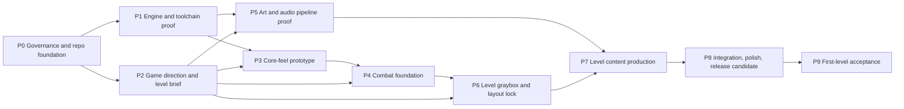

# High-level roadmap: from an empty repository to the first complete level

- **Status:** Draft for owner acceptance (Q-18). Written in session 1, 2026-09-26.
- **Goal (D-1):** one complete, polished, replayable level of a fast-paced, resource-limited first-person shooter, made with original content (D-2) in Unreal Engine 5 (D-3).
- **Scope of this file:** the phases, their dependencies, outcomes and exit gates. It doesn't list implementation tasks. Those go in focused roadmaps, which are created per [README.md](README.md) after this file is accepted (D-11).

**Labels:**

- **[E]** evidence, with a link;
- **[R]** recommendation;
- **[A]** assumption to test;
- **[U]** unknown.

Owner questions are cited as `Q-N` ([questions.md](../questions.md)) and settled items as `D-N` ([decisions.md](../decisions.md)).

## Starting point [E]

- `origin/main` holds a README, a `.gitignore` and the GPL-3.0 `LICENSE`. There is no Unreal project, CI, branch protection or asset.
- Unreal Engine, Git LFS and Blender aren't installed on the development Mac (M4, 16 GB, macOS 26.5.2).
- Unreviewed local prototype work exists outside `main` (Q-2). The roadmap doesn't rely on it.
- Details: [technology-and-art-pipeline.md § 0](../research/technology-and-art-pipeline.md#0-development-machine).

## Principles of the sequence

1. **Retire the costly unknowns first:**
   - legal: Q-1;
   - engine and toolchain: P1;
   - feel: P3;
   - combat loop: P4;
   - art pipeline: P5.

   All of these come before full-level layout and content production (P6 and P7), which are the expensive, hard-to-revise phases.
2. **Graybox before art.** Layout and pacing are proven with untextured geometry. Art is applied only after the layout lock.
3. **Owner gates at the product decisions.** Each phase names the owner questions it needs, and the gate where the owner signs off.
4. **Small PRs.** Each work area below is expected to split into several PRs of one concern each (D-5). The count and order are fixed in the focused roadmaps, not here.
5. **Proportional process.** Add a check or tool only when a phase's risk needs it ([role-model-patterns.md § 4](../research/role-model-patterns.md#4-gaps-and-risks-for-this-project)).

## Dependency overview

- **Parallel tracks [R]:**
  - P2 runs beside P1.
  - P5 runs beside P3 and P4, but must pass its gate before P7.
  - Front-end and settings work in P8 may start once P4 is done.
- **Critical path [R]:** P0 → P1 → P3 → P4 → P6 → P7 → P8 → P9.

## Phases

### P0: Governance and repository foundation

- **Objective:** a working, documented contribution loop with machine checks, so later PRs are cheap to review and hard to break.
- **Outcome:**
  - The docs system exists (this PR).
  - `main` is protected.
  - A docs check runs on every PR.
  - The cross-provider review and merge policy are in use.
- **Dependencies:** none.
- **Note:** P0's work areas are small and self-contained. After Q-18 they are carried out straight from this file, without a focused roadmap.
- **Major work areas:**
  - **P0.1** Documentation system, research and this roadmap. This is session 1's PR.
  - **P0.2** A docs-check CI workflow on hosted Linux: link and anchor check, ID format and uniqueness, the handoff-entry format, and a docs-only fast path.
  - **P0.3** A `main` ruleset as code plus a runbook: PRs required, squash only, no force-push or deletion, thread resolution, and the P0.2 check required. The owner applies or approves it.
  - **P0.4** Auto-merge enablement per Q-14, if the owner approves.
  - **P0.5** Optional: script the cross-provider review start (Q-15 option B).
  - **Later, gated on Q-16:** the Gitar gate.
- **Exit criteria and evidence:**
  - This PR is merged after a cross-provider review record in `docs/reviews/`.
  - The docs check is green on a PR, and red on a deliberate broken-link test.
  - The ruleset JSON matches the live settings (`gh api` output recorded).
  - Q-14, Q-15, Q-17 and Q-18 are answered.
- **Owner decisions:** Q-14, Q-15, Q-16 (when ready), Q-17, Q-18.

### P1: Engine and toolchain proof (risk reduction)

- **Objective:** show that the chosen engine, toolchain, source-control and test path work on the real machine before any gameplay is written.
- **Outcome:**
  - A minimal Unreal C++ project that compiles, opens, packages and runs a trivial automated test.
  - Measured build and memory costs.
  - A recorded CI evidence model.
- **Dependencies:**
  - P0.2, so PRs have checks.
  - **Q-1 answered.** Licensing blocks committing Unreal code.
  - Q-3, Q-4, Q-6 and Q-7 answered.
- **Major work areas:**
  - **P1.1** Machine setup runbook: engine and Xcode versions, install location, LFS. Owner actions are marked as such.
  - **P1.2** Minimal project scaffold:
    - `.uproject`, one runtime module, and the Enhanced Input default;
    - an empty test map;
    - `.gitattributes` for LFS;
    - build instructions in the README.
  - **P1.3** Headless automation-test and packaging commands, as scripts, with one trivial test.
  - **P1.4** An evidence template for engine PRs (build, test, package logs) and the CI decision (Q-8).
- **Exit criteria and evidence:**
  - A clean clone builds `Development Editor` and a packaged `Development` macOS build. Timings are recorded.
  - The packaged build launches and exits by command line.
  - One automation test passes headless, and its log is attached.
  - LFS round-trip: a fresh clone restores `.uasset` and `.umap` content.
  - Editor idle and peak RAM and disk use are recorded against the 16 GB machine. [U] until measured.
  - The choice between a World Partition and a non-World-Partition template is recorded with its reason (D-4).
- **Owner decisions:** Q-1, Q-3, Q-4, Q-6, Q-7, Q-8.

### P2: Game direction and level brief (design gate)

- **Objective:** turn the owner's intent into a short, testable brief before gameplay and content choices harden.
- **Outcome:** `docs/design.md` gains owner-approved pillars and the core combat loop, plus a **level brief** covering:
  - length;
  - number and types of spaces;
  - weapon and enemy roster size;
  - the resource model;
  - the replayability definition;
  - art direction.
- **Dependencies:** P0.1. Runs in parallel with P1.
- **Major work areas:**
  - **P2.1** Pillars and the core loop, including the original resource-recovery mechanic (Q-10).
  - **P2.2** Setting, tone and art-direction proposals, with the owner's choice (Q-9). Include a reference board of original direction, not copied assets.
  - **P2.3** Level brief and replayability criteria, stated as measurable targets (Q-11).
  - **P2.4** Content and provenance policy for art and audio (Q-12, Q-13).
- **Exit criteria and evidence:**
  - Q-9, Q-10 and Q-11 are answered and recorded as decisions.
  - The level brief states numeric targets: for example first-clear time range, number of combat spaces, roster sizes and replay criteria. [A] the targets in Q-11 are placeholders until the owner confirms.
- **Owner decisions:** Q-9, Q-10, Q-11, and Q-12/Q-13 in principle.

### P3: Core-feel prototype (feel gate)

- **Objective:** make moving, aiming and shooting feel fast and precise in a graybox test gym before building systems on top.
- **Outcome:**
  - A playable graybox "gym" with a movement set, first-person camera, input and remapping basics, one weapon, and targets.
  - All tuning values live in data.
- **Dependencies:** P1, P2.1 (verbs), Q-5 (platform, input and budget).
- **Major work areas:**
  - **P3.1** Player movement and camera, with metrics markers in the gym.
  - **P3.2** Input: Enhanced Input actions, sensitivity, invert and FOV settings.
  - **P3.3** One weapon end to end: fire, hit detection, feedback, ammo.
  - **P3.4** Test and measurement: automated movement and weapon tests, and a frame-time capture routine.
- **Exit criteria and evidence:**
  - The owner plays the packaged gym and records a **feel sign-off**, or a list of changes, as a `D-N`.
  - Frame time meets the Q-5 budget in the gym, with a captured profile.
  - Movement metrics are recorded (speeds, jump height, step height), because P6 layout rules derive from them.
  - Automated tests for movement and weapon rules pass headless.
- **Owner decisions:** Q-5; the feel sign-off.

### P4: Combat foundation (combat gate)

- **Objective:** prove the full resource-limited combat loop in an arena sandbox, as reusable rules rather than level-specific code.
- **Outcome:** an arena test map with:
  - the planned weapon set, or a representative subset;
  - the enemy archetypes from the brief;
  - the resource economy and recovery mechanic;
  - encounter and spawn scripting driven by placement and data;
  - damage feedback and a HUD;
  - death, restart and checkpoints.
- **Dependencies:** P3 feel gate; P2.1 and P2.3 (loop and roster).
- **Major work areas:**
  - **P4.1** Damage, health and resource rules, with the recovery mechanic.
  - **P4.2** Weapon framework and the roster.
  - **P4.3** Enemy AI archetypes. The choice of AI framework is made in the focused roadmap.
  - **P4.4** Encounter framework: arenas, waves, locks and triggers.
  - **P4.5** Feedback: hit and kill cues, HUD, placeholder audio and VFX.
  - **P4.6** Failure flow: death, checkpoint and restart.
- **Exit criteria and evidence:**
  - Encounters are built by placement and data alone. A new arena needs no new rule code.
  - The owner plays through the sandbox and signs off the **combat gate**, covering pacing, pressure and the resource tension, as a `D-N`.
  - Frame time stays within budget at the brief's maximum number of simultaneous enemies, with a profile attached.
  - Tests for the rules pass. Restart after death reaches play in a measured time.
- **Owner decisions:** the combat-gate sign-off. Any roster change goes back to P2 decisions.

### P5: Art and audio pipeline proof (pipeline gate)

- **Objective:** prove an incremental, repeatable content pipeline on one small space before paying for a whole level.
- **Outcome:** a **vertical-slice room** at target quality, with:
  - a modular kit and trims;
  - a few props;
  - lighting and audio;
  - and it meets the performance budget.
- **Dependencies:** P1, P2.2 (art direction). It runs in parallel with P3 and P4. It must use P3's movement metrics before the kit grid is frozen.
- **Major work areas:**
  - **P5.1** Standards: scale and grid, pivots, naming, collision, UVs and texel density, LOD policy, folders.
  - **P5.2** DCC round trip, for example Blender → FBX → Unreal, with the import settings recorded.
  - **P5.3** Kit and trim-sheet prototype.
  - **P5.4** Lighting approach, measured: dynamic vs Lumen software RT vs baked.
  - **P5.5** Audio pipeline and mix basics (Q-13).
  - **P5.6** Optional Meshy trial of one to three focal props, only with Q-12 approved and a budget set (D-8).
  - **P5.7** Provenance manifest and import validation checks.
  - **P5.8** Animation sourcing plan for enemies and first-person arms. [U] Not yet researched.
- **Exit criteria and evidence:**
  - The vertical-slice room meets the frame-time and memory budget, profiled on the target machine.
  - Revision cost is measured: the time to change one kit piece and see the change everywhere.
  - Every asset in the room has a provenance entry.
  - The import checks pass.
  - The owner approves the visual target as a `D-N`.
- **Owner decisions:** Q-9 (confirmation on the slice), Q-12, Q-13.

### P6: Level graybox and layout lock

- **Objective:** build and tune the **whole level** in graybox until its flow, pacing and difficulty work.
- **Outcome:** the full level is playable from start to finish in graybox, with every encounter, pickup, route and secret placed.
- **Dependencies:** P4 combat gate; P2.3 level brief; P3 metrics. P5 grid rules if they are ready; otherwise use graybox metrics only.
- **Major work areas:**
  - **P6.1** Beat chart and flow diagram, from the brief.
  - **P6.2** Graybox of each space, split into space-sized PRs.
  - **P6.3** Encounter placement and tuning passes.
  - **P6.4** Playtest protocol and a playtest log.
  - **P6.5** Map collaboration strategy (one editor per map, sublevels, or One File Per Actor), if contention appears.
- **Exit criteria and evidence:**
  - Recorded playthroughs meet the brief's first-clear time range.
  - There are no progression blockers, and navigation and collision faults are fixed.
  - Difficulty is tuned per the brief.
  - The owner records a **layout lock** `D-N`. After the lock, layout changes need an owner decision, because they now invalidate art.
- **Owner decisions:** the layout-lock sign-off.

### P7: Level content production

- **Objective:** apply the proven pipeline across the locked layout.
- **Outcome:** every space at target art and audio quality, lit, dressed, with VFX, and within budget.
- **Dependencies:** P5 pipeline gate; P6 layout lock.
- **Major work areas:** one PR group per space, split by space and discipline:
  - **P7.1** Kit and architecture pass.
  - **P7.2** Props and dressing.
  - **P7.3** Lighting.
  - **P7.4** Audio ambience and events.
  - **P7.5** VFX.
  - **P7.6** Performance passes: LODs, culling, material cost.
- **Exit criteria and evidence:**
  - The placeholder list is empty, or the owner has waived the items that remain.
  - Every space meets the frame-time and memory budget in its worst-case view, with profiles attached.
  - The provenance manifest is complete.
  - Automated import and asset checks pass.
- **Owner decisions:** approval of each space's art, or the waivers.

### P8: Integration, polish and release candidate

- **Objective:** turn a complete level into a complete, replayable *product*.
- **Outcome:** a packaged release-candidate build with:
  - a front-end;
  - settings and remapping;
  - pause, restart and results;
  - difficulty;
  - the replay features from the brief, such as score, time or rank;
  - accessibility basics;
  - tuning and bug fixes.
- **Dependencies:** P7. Front-end and settings can start after P4.
- **Major work areas:**
  - **P8.1** Front-end and game flow: menu → level → results → replay.
  - **P8.2** Settings, remapping and accessibility baseline.
  - **P8.3** Replayability features per the brief.
  - **P8.4** Tuning passes from playtests.
  - **P8.5** Bug triage and the release bug bar.
  - **P8.6** Packaging, signing if needed, and distribution format. Revisit the Windows question (Q-5).
- **Exit criteria and evidence:**
  - An RC build is packaged from a clean clone with a recorded command.
  - There are no known crash, blocker or progression bugs.
  - Each replayability criterion in the brief is measured and met.
  - The performance budget is met across the full level.
- **Owner decisions:** the release bug bar; distribution platform and format.

### P9: First-level acceptance

- **Objective:** the owner's formal acceptance of the first complete level.
- **Outcome:** an accepted, tagged build and a `D-N` that closes the goal of D-1.
- **Dependencies:** P8.
- **Major work areas:**
  - **P9.1** Acceptance checklist, derived from the D-1 goal and the brief.
  - **P9.2** Owner acceptance playthroughs on a clean packaged build.
  - **P9.3** Release tag and retrospective.
- **Exit criteria and evidence:**
  - The owner completes the level more than once, including on a replay setting.
  - The checklist is all met or waived.
  - The acceptance is recorded as a decision.
  - The release tag points at the accepted commit.
- **Owner decisions:** acceptance.

## Cross-cutting risks

The full list is in [technology-and-art-pipeline.md § 5](../research/technology-and-art-pipeline.md#5-risks). The ones that shape this sequence:

- **Licensing (Q-1)** blocks P1 and everything after it.
- **Feel or scope found late** would cause expensive rework. The P3, P4 and P6 gates exist for this reason.
- **Engine validation without hosted CI (Q-8).** Every engine PR must carry local evidence.
- **Scope creep beyond one level (D-1).** New levels or systems not in the brief go to `questions.md`, not into the plan.

## When this roadmap is complete

This high-level roadmap is **complete** when all of these hold:

1. It is merged after a cross-provider review (D-6).
2. The owner accepts it, or its revisions, as a decision (Q-18).
3. Each phase has an objective, dependencies, work areas, exit criteria and owner questions. This draft has them for P0–P9.

After that, focused roadmaps are created just in time, as [README.md](README.md) describes. This file is then updated only when a phase changes its scope, order, gate or status. Every such change cites a `D-N`.
